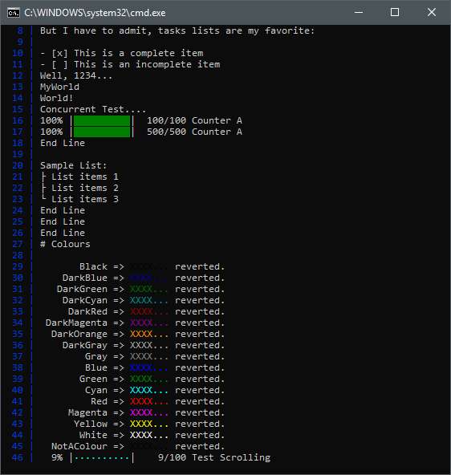
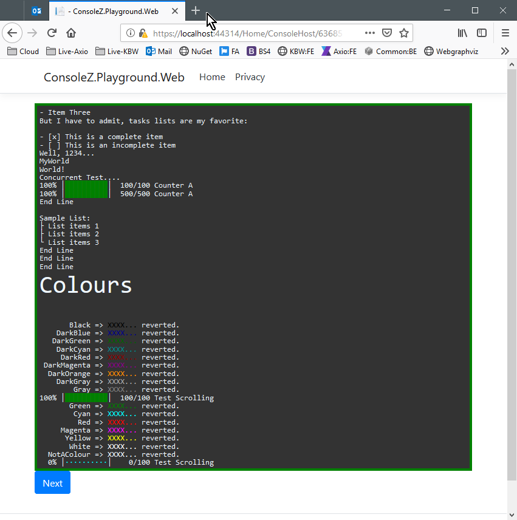
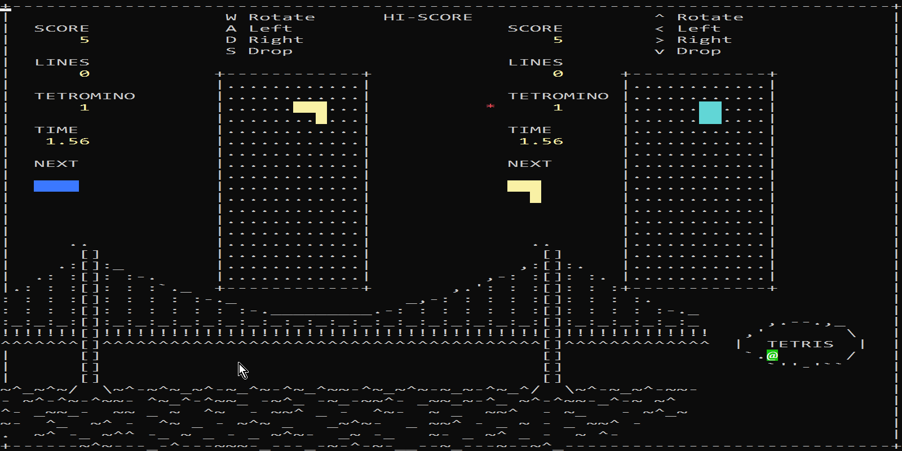

# ConsoleZ

> A modern console rendering library

Why use this library? What use cases?
- Want a common interface/experiance across console and web apps? 
- Want a richer output (colours, progress graphs)?
- Want to make a retro-console game like Tetris, Snake?
- Want Markdown in the console?

What this library does NOT do:
- Console Argument parsing
- Midnight-Commander like console forms

Key Features (done vs. in-progress):
- [X] Zero-dependancy
- [X] Windows 10 Console: ANSI Escape Codes
- [X] Alternative human readble inline colour formatting ```"^red;Error:^; Message"```
- [X] Fast full-screen updates. Allows Retro Console games. https://onelonecoder.com/olcconsolegameengine/
- [X] Unified ```IConsole``` working with HTML, WinForms, Console
- [X] UI Components : Percentage Complete Graph, etc
- [ ] ASCII large fonts
- [ ] Markdown formatting

## Screenshots






## The Idea?
In my current project we have lots of command logic that output calculation reports to the console. As the functionaliy matures, or reaches a larger audience, the it gets ported to the web.

Would it not be great if the console and html versions share the same interface and rendering abilities:
- Console Renders Markdown with ASCII-art and Console standard colours (Find closest Color -< ConsoleColour)
- Html Renders to a virtual console (thread-safe) and renders HTML Markdown

Interfaces:
 - ITextWriterBasic ( Write + WriteLine )
 - IVirtualConsole : ITextWriterBasic
    - Token
    - Title
    - Width
    - Height
    
Features:
- Markdown is the common format (Rendering to Console or HTML)
- ANSI escaping (+ HTML mapping)
- Threadsafe for the web (many IVirtualConsoles at once)
- Easy inline colours ```"Hello ^red;World^;" <-> string.Format("Hello {0}World{1}", Color.Red, Color.Default)```
- Updating progress bars ```[###... 50%]```

Stretch:
- Wolfram-style cell input/output consoles
- Standard ASP.NET core console terminal (with possible SignalR support)
- Very Fast console update/FPS see: https://github.com/OneLoneCoder/videos/blob/master/olcConsoleGameEngine.h


## Research / Related projects
- https://github.com/tomakita/Colorful.Console
- https://www.reddit.com/r/commandline/comments/3xgd2w/good_markdown_viewer_in_terminal/
- https://meta.stackexchange.com/questions/36833/markdown-console-application
- https://github.com/kneufeld/consolemd
- https://stackoverflow.com/questions/23904274/is-there-a-way-to-get-colored-text-in-github-flavored-markdown/41043795
- ANSI escape chars: http://www.lihaoyi.com/post/BuildyourownCommandLinewithANSIescapecodes.html
- https://stackoverflow.com/questions/34073467/ansi-coloring-console-output-with-net
- https://github.com/silkfire/Pastel

## Search Terms:
- "color console C#"
- "enhanced c# console"
